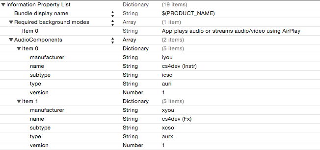
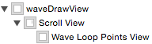

## How to Fully Integrate Csound into Apple&#39;s iOS CoreAudio

### **cs4dev - Csound for Developers**

Alessandro Petrolati
[www.apesoft.it](http://www.apesoft.it/) - info@apesoft.it

## Introduction

In this chapter we will study some strategies for a better integration of Csound with CoreAudio, in order to aid the development of iOS applications. There are some important issues to be considered for a professional audio application, such as the native &#39;Inter-App Audio&#39; routing, buffer frame etc… We will examine in detail the relevant code (Csound and Objective-C) taken from few audio apps based on Csound. We will learn how to manage the &#39;buffer frame&#39; and &#39;sampling rate&#39;; how to draw a &#39;Waveform&#39; in CoreGraphics from a Csound &#39;gen&#39;; how to write a Csound gen table and much more.

1. Setup Csound for an audio app
2. Enabling Inter-App Audio and Audiobus
3. Sampling rate and Buffer Frame Synchronization
4. Plot a Waveform from a Csound gen table
5. Write into a Csound gen table
6. Optimize performance and add a custom opcode

## Getting Started

The development of professional audio applications involves to consider some important aspects of iOS in order to maximize the compatibility and versatility of the app.

The approach should focus on these five important points:

1. Implement Background Audio
2. Switch on/off your Audio Engine
3. Implement Core MIDI
4. Do not Waste System Resources
5. Setup the Sampling Rate and Buffer Frame accordingto applications running in thesystem.

This text provide some useful guidelines for the code implementation and shows few examples concerning the interaction between _Csound_ and the graphical interface. The goal is to ensure a more sophisticated and comprehensive integration of _Csound_ in iOS.

The code for the User Interface (UI) is written in Objective-C while the Csound API (i.e. Application Programming Interface) are in &#39;C&#39;, this duality allows us to understand in detail the interactionbetween the two. As you will see in the next section, the control unit is based on the _callback_ mechanism rather than the _pull_ mechanism.

No Objective-C code was deliberately written in the &#39;C&#39; audio _callback_, since it is not recommended as well it is not recommended to allocate/de-allocate memory.

The tutorials wasconceived to be as much as possible &#39;opened&#39;, so that can be used as templates for the future projects.

Since often we will refer to the tutorials (_xCode_ projects), it would be useful to have on hand the _xCode_ environment.
[Online Tutorial](http://www.apesoft.it/dev)

## Setup for an Audio App

In the first _xCode_ project (_01\_csSetup__)_ we configure a &#39;Single View Application&#39; to work with audio and _Csound_. The project dependencies are the only **libcsound.a** and **libsndfile.a** with the headers (.h) files and _CsoundMIDI.h_ and _CsoundMIDI.m._

The code of _initializeAudio_ function will enable the input/output audio:

~~~
-(void)initializeAudio {
    
    /* Audio Session handler */
    AVAudioSession* session = [AVAudioSession sharedInstance];
    
    NSError* error = nil;
    BOOL success = NO;
    
    success = [session setCategory:AVAudioSessionCategoryPlayAndRecord
                       withOptions:(AVAudioSessionCategoryOptionMixWithOthers |
                                    AVAudioSessionCategoryOptionDefaultToSpeaker)
                             error:&error];
    
    success = [session setActive:YES error:&error];
    
    
    /* Sets Interruption Listner */
    [[NSNotificationCenter defaultCenter] addObserver:self
                                             selector:@selector(InterruptionListener:)
                                                 name:AVAudioSessionInterruptionNotification
                                               object:session];
    
    AudioComponentDescription defaultOutputDescription;
    defaultOutputDescription.componentType = kAudioUnitType_Output;
    defaultOutputDescription.componentSubType = kAudioUnitSubType_RemoteIO;
    defaultOutputDescription.componentManufacturer = kAudioUnitManufacturer_Apple;
    defaultOutputDescription.componentFlags = 0;
    defaultOutputDescription.componentFlagsMask = 0;
    
    // Get the default playback output unit
    AudioComponent HALOutput = AudioComponentFindNext(NULL, &defaultOutputDescription);
    NSAssert(HALOutput, @"Can't find default output");
    
    // Create a new unit based on this that we'll use for output
    err = AudioComponentInstanceNew(HALOutput, &csAUHAL);
    
    // Enable IO for recording
    UInt32 flag = 1;
    err = AudioUnitSetProperty(csAUHAL,
                               kAudioOutputUnitProperty_EnableIO,
                               kAudioUnitScope_Input,
                               1,
                               &flag,
                               sizeof(flag));
    // Enable IO for playback
    err = AudioUnitSetProperty(csAUHAL,
                               kAudioOutputUnitProperty_EnableIO,
                               kAudioUnitScope_Output,
                               0,
                               &flag,
                               sizeof(flag));
    
    err = AudioUnitInitialize(csAUHAL);
    
    
    /* AUDIOBUS and IAA  */
    [self initializeAB_IAA];
}
~~~

This code is common to many audio applications, easily available online or from the Apple documentation.
Basically, we setup the app as _PlayAndRecord_ category, then we create the AudioUnit. The _PlayAndRecord_ category allows receiving audio from the system and simultaneously produce audio.

**IMPORTANT:**

For proper operation with Audiobus (AB) and Inter-App Audio (IAA), you must instantiate and initialize one Audio Unit (AU), once for the entire life cycle of the app.Destroy and recreate the AU, it involves upgrading of the memory of the same (for each instance).If the app is connected to IAA or AB stops responding and you experience unpredictable behavior, which may lead to an unexpected crash.

Actually there is no way to tell at runtime AB and / or IAA which the our AU address has changed.The _InitializeAudio_ function it should be called only once, unlike the functions run/stop of _Csound_.

These aspects will be more clarified in the following paragraphs.

## Initialize Csound and Communicate with him

The **_AudioDSP.m_** class, implements the entire audio structure and manages the user interface interaction with _Csound_, _AudioDSP_ is a subclass of _NSObject_ that is instantiated on the **_Main.storyboard_**.

Indeed, a reference to this class on the storyboard greatly facilitates connections between the GUI (i.e. IBOutlet and IBAction) and DSP (Digital Signal Processing ) i.e. _Csound_.

As you will see in the next section, all links are established graphically with &#39;Interface Builder&#39;.

The main CSOUND structure is allocated in the AudioDSP constructor and is initialized the audio system. This approach foresees that the _\_cs_ (CSOUND\*) class variable, persists for the entire life cycle of the app and, as mentioned, the _initializeAudio_ function should be called only one time.

However it has not adopted the &#39;singleton&#39;pattern design for clarity of reading of the code.

~~~
- (instancetype)init {
    self = [super init];
    if (self) {

        // Creates an instance of Csound
        _cs = csoundCreate(NULL);

        // Setup CoreAudio
        [self initializeAudio];
    }
    return self;
}
~~~

Since we have the CSOUND structure allocated and the CoreAudio properly configured, we can manage _Csound_ asynchronously.

The main purpose of this simple example, is to study how the user interface (UI) interact with _Csound,_ all connections have been established and managed graphically through &#39;Interface Builder&#39;.

The UISwitch object is connected with the toggleOnOff, which has the task to toggle on/off _Csound_ in this way:

~~~
-(IBAction)toggleOnOff:(id)component {
    
    UISwitch* uiswitch = (UISwitch*)component;
   
    if(uiswitch.on) {
        
        NSString *tempFile = [[NSBundle mainBundle] pathForResource:@"test" ofType:@"csd"];
       
        [self stopCsound];
        [self startCsound:tempFile];
        
    } else {
        [self stopCsound];
    }
}
~~~

In the example is performed the _test.csd Csound_ Orchestra which implements a simple sinusoidal oscillator. The frequency of the oscillator is controlled by the UISlider object. This is linked with the _sliderAction_ callback.

As anticipated, the mechanism adopted is driven by events (callback), it means that the function associated with the event is called only when the user performs an action on the UI slider.

In this case the action is of type &#39;Value Changed&#39;, you should consult the Apple documentation concerning the UIControl framework, for further clarification in this regard.

~~~
-(IBAction)sliderAction:(id)sender {
     
   UISlider* sld = sender;

	if (!_cs || !running)  return;
        
	NSString* channelName = @"freq";
	float *value;
	csoundGetChannelPtr(_cs, &value, [channelName cStringUsingEncoding:NSASCIIStringEncoding],
                            CSOUND_CONTROL_CHANNEL | CSOUND_INPUT_CHANNEL);
        
	*value = (float) sld.value;

}
~~~

As we can see, we get the pointer through _csoundGetChannelPtr_, this is relative to incoming control signals (k).

From the point of view of _Csound_, the signals in input (CSOUND\_INPUT\_CHANNEL) are sampled from bus software _chnget_ while in output (CSOUND\_OUTPUT\_CHANNEL) from _chnset_.

The allocation is done by dereferencing the pointer in this way:

~~~
	*value = (float) sld.value;
~~~

ossia

~~~
	value[0] = (float) sld.value;
~~~

The _channelName_ string (&#39;freq&#39;) is the reference text used by the _chnget_ opcode in the _instr 1_ of _Csound_ Orchestra.

~~~
	kfr chnget "freq" 
~~~

Please consult the official documentation of &#39;Csound for iOS&#39; for further clarification.

Since the control architecture is based on the _callback_ mechanism and therefore depends from the user actions, we must send all values whenever _Csound_ enters in execution.

This falls entirely under the responsibility of the developer, we can use the Csound&#39;s delegate:

~~~
-(void)csoundObjDidStart {

   [_freq sendActionsForControlEvents:UIControlEventAllEvents];
}
~~~

This operation must be repeated for all UI widgets in practice, just after _Csound_ is running we send an _UIControlEventAllEvents_ message at all widgets, so be sure that _Csound_ receive properly the current state of the UI&#39;s widgets values.

In this case _\_freq_ is the reference (IBOutlet) of the UISlider in the _**Main.storyboard.**_

## Enabling Audiobus and Inter-App Audio

The last line of code in the _initializeAudio_ function, calls the _initializeAB\_IAA_ for initialize and configure the Inter-App Audio and Audiobus.

The _XCode_ tutorials does not includes the Audiobus SDK since it is covered by license, see the website for more information and to consult the official documentation
[here](http://audiob.us).

However the existing code to Audiobus should ensure proper functioning after the inclusion of the library.

In the file AudioDSP.h there is two macro: &#39;AB&#39; and &#39;IAA&#39; these are used to include or exclude the needed code. The first step is to configure the two _AudioComponentDescription_ for the types:
_kAudioUnitType\_RemoteInstrument_ and _kAudioUnitType\_RemoteEffect_.

~~~
/* Create Sender and Filter ports */
AudioComponentDescription desc_instr = {
	kAudioUnitType_RemoteInstrument,
	'icso',
	'iyou', 0, 0 
};
    
AudioComponentDescription desc_fx = {
	kAudioUnitType_RemoteEffect,
	'xcso',
	'xyou', 0, 0 
};
~~~

This point is crucial because you have to enter the same information in the file _Info.plist_

In the _Info.plist_ (i.e. Information Property List) It&#39;s very important to declare the _Bundle display name_ key and &#39;_Require background modes_&#39; to enables the audio in the background.

The app must continue to play audio even when it is not in the foreground. Here you configure the &quot;Audio Components&quot; (i.e. AU).

~~~
typedef struct AudioComponentDescription {
    OSType              componentType;
    OSType              componentSubType;
    OSType              componentManufacturer;
    UInt32              componentFlags;
    UInt32              componentFlagsMask;
} AudioComponentDescription;
~~~

As said, the _AudioComponentDescription_ structure used for the configuration of the AU, must necessarily coincide in the _Info.plist_,

The structure fields (_OSType_) are of _FourCharCode_, so they must be four characters.

IMPORTANT: it is recommended to use different names for both _componentSubType_ and _componentManufacturer_ of each _AudioComponent_. In the example the character &#39;i&#39; and &#39;x&#39; refer to _Instrument_ and _Fx_.

Only for the first field (componentType) of the AudioComponentDescription structure, you can use the enumerator

~~~
enum {
    kAudioUnitType_RemoteEffect         = 'aurx',
    kAudioUnitType_RemoteGenerator      = 'aurg',
    kAudioUnitType_RemoteInstrument     = 'auri',
    kAudioUnitType_RemoteMusicEffect    = 'aurm'
};
~~~

where _auri_ identifies the Instrument (Instr) and _aurx_ the effect (Fx), at which point the app will appear on the lists of the various &#39;IAA Host&#39; as Instr and Fx and in Audiobus as Sender or Receiver.

At this point we are able to:

1. Audio in background
2. IAA and AB support for Input/output
3. DSP (Csound) on/off toggle
4. Controlling _Csound_ through _callback_ mechanism
5. Recording the Output audio

In the following sections we will see how to manage the advanced settings for _Csound ksmps_, according to system BufferFrame.

## Buffer Frame vs ksmps

In IOS, the first audio app who is running or who is running in background, imposes the own Sampling Rate and BuffeFrame to the whole iOS (i.e. for all audio apps).

IOS allows BufferFrame values power of 2 ​​in the range 64, 128, 256, 512, 1024, etc ...

And not recommended to use values ​​greater than 1024 or lower than 64, a good compromise is 256, as suggests the default value of _GarageBand_ and Other Similar Applications.
In the Csound language, the BufferFrame is expressed as _ksmps_. The_ksmps_ can be an integer between 1 and Sampling Rate (i.e. sr), as reported in the _Csound_manual:

_These statements are global value made at the beginning of an orchestra, before any instrument block is defined and it cannot be changed during Csound Performance._

_ksmps = (optional) -- set the number of samples in a control period. This value must equal sr/kr._

_The default value is 10._

Since it is highly inconvenient to process the audio signal each sample (atsample), theBufferFrame (or _ksmps_ in _Csound_) regulates the number of samples between the calls ofaudio system_callback. At this point it becomes necessary to manage appropriately the values ofBufferFrame and _ksmps_.

There are three main possible solutions:

1. Keep the _ksmps_ static with a very low value, such as 32 or 64
2. Dynamically manage the _ksmps_ depending on BufferFrame
3. Implement a mechanism for release of the two values

All three cases have advantages and disadvantages, in the first case the BufferFrame must be always \&gt;= _ksmps_, as the second must implement a spartan workaround for synchronize the _ksmps_ with the BuffrFrame.

The third and more complex case, requires a control at run-time on the audio _callback_ andwe must

manage an accumulation buffer. Thanks to this, the BufferFrame may be\&gt;=\&lt;of_ksmps_ orvice versa. However there are some limitations infact this approach does not always lead to thebenefitshoped for in terms of performance. The motivation goes beyond this discussion, please refer to adeepening future.

## Static ksmps

An example of the first case just listed, is in the Orchestras of &#39;Csound for iOS&#39;, in fact the _ksmps_ is deliberately 64 and can not be changed.

As mentioned, the BufferFrame of iOS is always greater or equal than 64. The operation is assured thanks to the &#39;for&#39; statement in the _Csound\_Render:_

~~~
OSStatus  Csound_Render(void *inRefCon,
                         AudioUnitRenderActionFlags *ioActionFlags,
                         const AudioTimeStamp *inTimeStamp,
                         UInt32 dump,
                         UInt32 inNumberFrames,
                         AudioBufferList *ioData
                         )
{

    //…
	/* inNumberFrames => ksmps */
	for(int i = 0; i < (int)slices; ++i){
		ret = csoundPerformKsmps(cs);
	}
    //…
}
~~~

This &#39;C&#39; routine is called from the CoreAudio every _inNumberFrames_ (i.e. BufferFrame).

The _ioData_ pointer contains _inNumberFrames_ of audio samples incoming from the input (mic/line),_Csound_ read this data and it returns _ksmps_ processed samples.

When the _inNumberFrames_ and _ksmps_ are identical, we can simply copy out the processed buffer, this is done by calling the csoundPerformKsmps() procedure.Since that _ksmps_ is less or equal to _inNumberFrames_, we need to call _N slices_ the _csoundPerformKsmps()_.

As said, the strong point of this mechanism is that _ksmps_ is never greaterthan _inNumberFrames_.

Example:

~~~
ksmps = 64
inNumberFrames = 512

slices is calculated as follows:

int slices = inNumberFrames / csoundGetKsmps(cs);

slices is 8
~~~

In other words, every _Csound\_Render_ call involves eight sub-calls to _csoundPerformKsmps()_, for every sub-call we fill the _ioData_ with _ksmps_ samples.

## Dynamic ksmps, Buffer Frame and Sampling Rate Synchronization

The _ksmps_ value should be chosen according to the&#39;Csound Orchestra&#39; operating logic, for the Orchestras particularly heavy in terms of control (operations on variables k), which howeverdo not require low-latency, we can use higher values as 512 or 1024.

Increasing the _ksmps_ we spare considerably the overhead of function calls (_k_ functions) and it reduces the CPU load, this makes it possible to run orchestras complex even on first generation devices.

The second case in question was adopted for apps developed so far, in fact, except in cases specific, it is always convenient to set the _ksmps_ with the same value of BufferFrame system.

If necessary, we should inform the user (for example, with a text message) whether the application works with values not suited.

Since the _ksmps_ cannot be changed during the _Csound_performance, it is necessary a workaround to change it at the textual level, directly on the file Orchestra this value.

The following steps are required:

1. Stop and Cleaning _Csound_ Object
2. Replace the Orchestra (.csd) Code with new _sr_ and _ksmps_
3. Initialize and Run _Csound_ Object with new modifyed Orchestra

This is a crass workaround but it works properly, we must enter a couple of placeholders in the Orchestra file.

~~~
<CsInstruments>
sr = 44100
ksmps = 512

;;;;SR;;;;		//strings replaced from Objective-C
;;;;KSMPS;;;;	

nchnls = 2
0dbfs = 1

…
~~~

The two univocal strings are the placeholders for _sr_ and _ksmps_. Please note they begin with the semicolon character since _Csound_ recognizes it as a comment.

The following function Objective-C, looks for the placeholders in the _myOrchestra.csd_ and replaces them with new sr and _ksmps_ values.

~~~
-(void)csoundApplySrAndKsmpsSettings:(Float64)sr withBuffer:(Float64)ksmps {

   NSString *pathAndName = [[[NSBundle mainBundle] resourcePath] 	
	stringByAppendingString:@"/myOrchestra.csd"];
    
    if ([[NSFileManager defaultManager] fileExistsAtPath:pathAndName])
    {
        NSString *myString = [[NSString alloc] initWithContentsOfFile:pathAndName 
			encoding:NSUTF8StringEncoding error:NULL];
        
        myString = [myString stringByReplacingOccurrencesOfString:@";;;;SR;;;;" 				withString:
			[NSString stringWithFormat:@"sr = %f”, sr]];

        myString = [myString stringByReplacingOccurrencesOfString:@";;;;KSMPS;;;;" 				withString:
			[NSString stringWithFormat:@"ksmps = %f”, ksmps]];
        
        NSString *pathAndNameRUN = [NSString stringWithFormat:@"%@dspRUN.csd", 					NSTemporaryDirectory()];
        
		NSError* error = nil;

       //save copy of dspRUN.csd in library directory
       [myString writeToFile:pathAndNameRUN
                   atomically:NO
                     encoding:NSUTF8StringEncoding
                        error:&error];
        
       //Run Csound
       [self startCsound:pathAndNameRUN];
   }
    else
        NSLog(@"file %@ Does Not Exists At Path!!!", pathAndName);
}
~~~

The NSString _pathAndName_ contains the file path of _myOrchestra.csd_ in the Resources folder.This path is used to copyin _myString_ the entire file (as NSString).Subsequently the _stringByReplacingOccurrencesOfString_ method, replaces the placeholders with the valid strings.

Example:

~~~
sr = 44100		//strings replaced from Objective-C
ksmps = 512
~~~

Since iOS does not allow to edit files in the application &quot;Resources&quot; folder (i.e. _pathAndName_), we need to save the modified version in the new file _dspRUN.csd_ that is saved in the temporary folder (i.e. _pathAndNameRUN_), this is achieved through the _writeToFile_ method.

As a final step it is necessary re-initialise _Csound_ by calling the _runCsound_ which sends it running with the appropriate values of _sr_ and _ksmps._

## Release ksmps from Buffer Frame

As seen the second case is a good compromise, however it is not suitable in some particular conditions.So far we have only considered the aspect in which the app works on the main audio thread, with a BufferFrame imposed by iOS. However, there are special cases in which the app is called to work on a different thread and with a different BufferFrame.

For instance the &#39;freeze track feature&#39; implemented by major &#39;Host IAA apps&#39; (such Cubasis, Auria etc ...) bypasses the current setup of iOS and imposes an arbitrary BufferFrame(usually 64).

Since _Csound_ it is still configured with the iOS BufferFrame (main audio thread) but during the &#39;freeze track&#39; process the _Csound\_Perform_ routine is called with a differentBufferFrame, _Csound_ cannot work properly.

In order to solve this limitation we need a run-time control on the audio callback and handle the exception.

On the _Csound\_Render_ we will evaluate the condition for which _slices_ is \&lt;1

~~~
OSStatus  Csound_Perform(void *inRefCon,
                         AudioUnitRenderActionFlags *ioActionFlags,
                         const AudioTimeStamp *inTimeStamp,
                         UInt32 dump,
                         UInt32 inNumberFrames,
                         AudioBufferList *ioData
                         ) {
    
   
    //…

    /* CSOUND PERFORM */
    if (slices < 1.0) {
     /* inNumberFrames < ksmps */
        Csound_Perform_DOWNSAMP(inRefCon, 
			ioActionFlags, 
			inTimeStamp, 
			dump, 
			inNumberFrames, 
			ioData);
    }
    else {

		/* inNumberFrames => ksmps */
		for(int i = 0; i < (int)slices; ++i){
			ret = csoundPerformKsmps(cs);
	  }
   //…
}
~~~

Please note that _slices_ is calculated as follows:

int slices = inNumberFrames / csoundGetKsmps(cs);

Every time the _ksmps_ (for some reason) is greater than BufferFrame,we will perform the _Csound\_Perform\_DOWNSAMP_ procedure.

~~~
//Called when inNumberFrames < ksmps
OSStatus  Csound_Perform_DOWNSAMP(void *inRefCon,
                                  AudioUnitRenderActionFlags *ioActionFlags,
                                  const AudioTimeStamp *inTimeStamp,
                                  UInt32 dump,
                                  UInt32 inNumberFrames,
                                  AudioBufferList *ioData
                                  )
{
    AudioDSP *cdata = (__bridge AudioDSP*) inRefCon;

    int ret = cdata->ret, nchnls = cdata->nchnls;
    CSOUND *cs = cdata->_cs;
    
    MYFLT *spin = csoundGetSpin(cs);
    MYFLT *spout = csoundGetSpout(cs);
    MYFLT *buffer;
    
    /* DOWNSAMPLING FACTOR */
    int UNSAMPLING = csoundGetKsmps(cs)/inNumberFrames;
    
    if (cdata->counter < UNSAMPLING-1) {
        
        cdata->counter++;
    }
    else {
        
        cdata->counter = 0;
        
        /* CSOUND PROCESS KSMPS */
        if(!cdata->ret) {
            /* PERFORM CSOUND */
            cdata->ret = csoundPerformKsmps(cs);
        } else {
            cdata->running = false;
            
        }
    }
    
    /* INCREMENTS DOWNSAMPLING COUNTER */
    int slice_downsamp = inNumberFrames * cdata->counter;
    
    /* COPY IN CSOUND SYSTEM SLICE INPUT */
    for (int k = 0; k < nchnls; ++k){
        buffer = (MYFLT *) ioData->mBuffers[k].mData;
        for(int j = 0; j < inNumberFrames; ++j){
            spin[(j+slice_downsamp)*nchnls+k] = buffer[j];
        }
    }
    
    /* COPY OUT CSOUND KSMPS SLICE */
    for (int k = 0; k < nchnls; ++k) {
        buffer = (MYFLT *) ioData->mBuffers[k].mData;
        for(int j = 0; j < inNumberFrames; ++j) {
            
            buffer[j] = (MYFLT) spout[(j+slice_downsamp)*nchnls+k];
        }
    }
    
    cdata->ret = ret;
    return  noErr;
}
~~~

As mentioned we need a buffer for the accumulation, however, it is not necessary to create a new one since you can directly use those of _Csound_, i.e. _spin_ and _spout_.

First we have to evaluate what is the level of under-sampling through.

Example:

~~~
Csound ksmps = 512
iOS inNumberFrames = 64

/* DOWNSAMPLING FACTOR */
int UNSAMPLING = csoundGetKsmps(cs)/inNumberFrames;

UNSAMPLING is 8
~~~

This value represents the required steps to accumulate the input signal in spin for every call of csoundPerformKsmps().

~~~
if (cdata->counter < UNSAMPLING-1) {
        
	cdata->counter++;
}
else {
        
	cdata->counter = 0;
        
	/* CSOUND PROCESS KSMPS */
	if(!cdata->ret) {
		cdata->ret = csoundPerformKsmps(cs);
}
~~~

The _Csound\_Perform\_DOWNSAMP_ routine is called by iOS every 64 samples, while we must call _csoundPerformKsmps()_ after 512 samples, it means we need to skip eight times (i.e. UNSAMPLING) until we have collected the input buffer.

From another point of view, before calling _csoundPerformKsmps()_ we must accumulate eight

_inNumberFrames_ in _spin_, and for every call of_Csound\_Perform\_DOWNSAMP_ we must returns _inNumberFrames_ from _spout_.

In the example, the iOS audio is in the _buffer_ who is a pointer of the _ioData_ structure.

~~~
/* INCREMENTS DOWNSAMPLING COUNTER */
int slice_downsamp = inNumberFrames * cdata->counter;
    
/* COPY IN CSOUND SYSTEM SLICE INPUT */
for (int k = 0; k < nchnls; ++k){
	buffer = (MYFLT *) ioData->mBuffers[k].mData;
	for(int j = 0; j < inNumberFrames; ++j){
		spin[(j+slice_downsamp)*nchnls+k] = buffer[j];
	}
}
    
/* COPY OUT CSOUND KSMPS SLICE */
for (int k = 0; k < nchnls; ++k) {
	buffer = (MYFLT *) ioData->mBuffers[k].mData;
	for(int j = 0; j < inNumberFrames; ++j) {
            
		buffer[j] = (MYFLT) spout[(j+slice_downsamp)*nchnls+k];
	}
}
~~~

Ignoring the implementation details regarding the de-interlacing of the audio, we can focus on the _ **slice\_downsamp** _ which serves as offset-index for the arrays _spin_ and _spout_.

The implementation of both second and third cases, guarantees that the app works properly in every situation.

## Plot a Waveform

In this section we will see a more complex example to access memory (_gen_) of _Csound_ and display the contents on a UIView.

The _waveDrawView_ class interacts with the waveLoopPointsView, the _loopoints_ allow us to select a portion of the file via the zoom on the waveform (pinch in / out).These values (loopoints) are managed by Csound which ensures the correct reading of the file and returns the normalized value (i.e. 0 ÷ 1) of the instantaneous phase of reading.

The two classes are instantiated in _**Main.storyboard**_, please note to the hierarchy that must be respected for the setup of other projects as well as the three _UIView_ must have the same size (frame) and cannot be dynamically resized.

In the score of the file _csound\_waveform.csd_ file are declared two _gen_ (i.e. _gen_ 1) to load in memory the WAV files:

~~~
f2 0 0 1 "TimeAgo.wav" 0 0 1
f3 0 0 1 "Density_Sample08.wav" 0 0 1
~~~

In order to access the audio files in the app Resources folder, we need to setup some environment variables for _Csound_, this is done in the _runCsound_ function.

From the _Csound_ manual:

_You can set environment variables on the command line by using the command line flag --env:NAME=VALUE or --env:NAME+=VALUE, where NAME is the environment variable name, and VALUE is its value._

**SFDIR: Default directory for sound files. Used if no full path is given for sound files.**

**SADIR: Default directory for analysis files. Used if no full path is given for analysis files.**

This code sets both SFDIR and SADIR:

~~~
// Set's Environment Sound Files Dir
NSString *resourcesPath = [[NSBundle mainBundle] resourcePath];    
NSString* envFlag = @"--env:SFDIR+=";

char* SFDIR = (char*)[[envFlag stringByAppendingString:resourcesPath] cStringUsingEncoding:NSASCIIStringEncoding];

envFlag = @"--env:SADIR+=";
char* SADIR = (char*)[[envFlag stringByAppendingString:resourcesPath] cStringUsingEncoding:NSASCIIStringEncoding];

char *argv[4] = { "csound", SFDIR, SADIR, (char*)[csdFilePath cStringUsingEncoding:NSASCIIStringEncoding]};
    
ret = csoundCompile(_cs, 4, argv);
~~~

The interaction between _Csound_ and the UI is two-way, the class method _drawWaveForm_ draws the contents of the _genNum_.

~~~
[waveView drawWaveFromCsoundGen:_cs genNumber:genNum];
~~~

After calling this method, we need to enable an _NSTimer_ object in order to read continuosly (pull) the phase value returned by _Csound_.Please examine the _loadSample\_1_ function code, for insights.

The timer is disabled when the DSP is switched off, in the timer-callback we get the pointer, this time from CSOUND\_OUTPUT\_CHANNEL, finally we use this value for synchronize the graphics cursor on the waveform (scrub) in the GUI.

~~~
- (void)updateScrubPositionFromTimer {
    
    if (!running)
        return;
    
    MYFLT* channelPtr_file_position = nil;
    csoundGetChannelPtr(_cs, &channelPtr_file_position,
                        [@“file_position_from_csound”
					cStringUsingEncoding:NSASCIIStringEncoding],
                        	CSOUND_CONTROL_CHANNEL | CSOUND_OUTPUT_CHANNEL);
    
    if (channelPtr_file_position)
        [waveView updateScrubPosition:*channelPtr_file_position];
}
~~~

In the Orchestra we find the corresponding code for write in the software bus.

~~~
	chnset kfilposphas , "file_position_from_csound"
~~~

## Write into a Csound gen table

We already have seen how to read from the _Csound_&#39;s gen memory, in this section we will focus on the write operation with two possible ways.

The goal is to modify a table in realtime while being read (played) by an oscillator LUT (i.e. look-up table), a **Pad** XY, to the left in the UI, manages the interpolation on the four prototypes and, to the right of the interface, a **16-slider** surface controls the harmonic content of a wave.

Concerning the first example (pad morph), the waveform interpolations are implemented in the Orchestra file and performed by _Csound_. The UI communicates with _Csound_, by activating an instrument (i.e. _instr_ 53), through a &#39;score message&#39;.Instead, in the second example (16-slider surface) the code is implemented in the _**AudioDSP.m**_ file and, precisely, in the _didValueChanged_ delegate. The architecture of this second example is based on addArm procedure that write in a temporary array. The resulting waveform is then copied on the gen-table, via the _csoundTableCopyIn_ API.

In the first example, the &#39;_instr 53_&#39; is activated via a &#39;score message&#39; to every action on the pad, this is performed in ui\_wavesMorphPad:

~~~
NSString* score = [NSString stringWithFormat:@"i53 0 %f %f %f", 
								UPDATE_RES, 
								pad.xValue, 
								pad.yValue];

csoundInputMessage(_cs, [score cStringUsingEncoding:NSASCIIStringEncoding]);
~~~

The &#39;_instr_ 53&#39; is kept active for UPDATE\_RES sec (0.1), the_maxalloc_ opcode limits the number of simultaneous instances (notes). Thus, any score events which falls inside UPDATE\_RES time, are ignored.

	maxalloc 53,1  ;iPad UI Waveforms morphing only 1 instance

This results as a sub-sampling of Csound ‘instr 53’, compared to the UI pad-callback. The waveform display's process is done by the Waveview class, it is a simplified version of the WaveDrawView class, introduced in the tutorial (**04_plotWaveForm**), that does not deserves particular investigation.
As mentioned, the waveforms's interpolations are performed by Csound, hereinafter is the 'instr 53' code:

~~~
tableimix giWaveTMP1, 0, giWaveSize, giSine, 0, 1.-p4, giTri, 0, p4
tableimix giWaveTMP2, 0, giWaveSize, giSawSmooth, 0, 1.-p4, giSquareSmooth, 0, p4
tableimix giWaveMORPH, 0, giWaveSize, giWaveTMP2, 0, 1.-p5, giWaveTMP1, 0, p5

chnset giWaveMORPH , "wave_func_table"
~~~

The p4 and p5 p-fields, are the XY pad axes used as weights for the three vector-interpolations which are required.The _tablemix_ opcode, mixes two tables with different weights into _giWaveTMP1_ destination table.In this case we interpolate a Sine Wave (i.e. _giSine_) with a triangular (i.e. _giTri_), while in the second line between _giSawSmooth_ and _giSquareSmooth_,the result is in _giWaveTMP2_. At last of the process, _**giWaveMORPH**_ contain the interpolated values of the two _giWaveTMP1_ and _giWaveTMP2_ arrays.

The global _ftgen_-tables, deliberately have been declared with the &#39;_p1__&#39;_ value to zero.This means that the _gen_-table number is assigned dynamically from _Csound_ at compile time. Since we do not know the number assigned, we must return the number of function through _chnset_ at runtime.

In the _**AudioDSP.m**_ class there is the implementation&#39;s code of the second example.

The _APE\_MULTISLIDER_ class returns, through its own delegate method didValueChanged, an array with the indexed values of the sliders. These are used as amplitude-weights for the generation of the harmonic additive waveform.Let&#39;s leave out the code about the wave&#39;s amplitude normalization and we focus on this code:

~~~
MYFLT *tableNumFloat;
csoundGetChannelPtr(_cs, &tableNumFloat, 
	[@"harm_func_table" cStringUsingEncoding:NSASCIIStringEncoding],
                                CSOUND_CONTROL_CHANNEL | CSOUND_INPUT_CHANNEL);

/* Contain the table num (i.e. giWaveHARM) */
int tableNum = (int) *tableNumFloat;

/* Contain the table (giWaveHARM) Pointer */
MYFLT *tablePtr;
int tableLength = csoundGetTable(_cs, &tablePtr, tableNum);
            
/* Is invalid? Return */
if (tableLength <= 0 || tableNum <= 0 || !tablePtr) return;
            
/* Clear temporary array  */
memset(srcHarmonic, 0, tableLength * sizeof(MYFLT));

/* Generate an additive sinusoidal waveform with 16 harmonics */
for(int i = 0; i < maxnum; ++i) {
	[self appendHarm:i+1 
			Amp:(powf(value[i], 2.0))*average 
			SIZE:tableLength 
			DEST:srcHarmonic];
}
            
/* Write array in the Csound Gen Memory (i.e. giWaveHARM) */
csoundTableCopyIn(_cs, tableNum, srcHarmonic);
~~~

This function also can be sub-sampled by de-commenting the _DOWNSAMP\_FUNC_ macro. This code is purely for purposes of example as it can be significantly optimized, in the case of vectors&#39;s operations, the Apple _vDSP_ framework could be an excellent solution.

## Optimize performance and add a custom opcode

In this final section we'll understand how to use the programming environment to implement a _ocpode_ directly on _**AudioDSP**_ class and add it to the list of opcodes of Csound without re-compile _Csound_. This is fundamental in order to optimize some processes audio particularly heavy from the point of view of the CPU.In fact, outside of Csound it will be possible to use a series of instruments such as the highly powerful vDSP of Apple, especially for the implementation of FFT routines (i.e. Fast Fourier Transform).
The guidelines are consistent with the official documentation of Csound.
The steps involved are three:

1. add custom opcode to Csound list
2. declare opcode structure
3. functions implementation

The first step must be made in the _runCsound_, before calling _csoundCompile_.

~~~
csoundAppendOpcode(cs, "MOOGLADDER", sizeof(MOOGLADDER_OPCODE),
                       0, 3, "a", "akk", iMOOGLADDER, kMOOGLADDER, aMOOGLADDER);
~~~

Appends an opcode implemented by external softwareto Csound&#39;s internal opcode list.The opcode list is extended by one slot,and the parameters are copied into the new slot.

Basically, what we have done is declare three pointers to functions (iMOOGLADDER, kMOOGLADDER and aMOOGLADDER) implemented in the class AudioDSP.

The second step is to declare the data structure used from opcode in the **AudioDSP.h**, you must include the header file csdl.h according to documentation:

_Plugin opcodes can extend the functionality of Csound, providing new functionality that is exposed
as opcodes in the Csound language. Plugins need to include this header file only, as it will bring all necessary data structures to interact with Csound. It is not necessary for plugins to link to the libcsound library, as plugin opcodes will always receive a CSOUND* pointer (to the CSOUND_struct) which contains all the API functions inside.This is the basic template for a plugin opcode. See the manual for further details on accepted types and function call rates. The use of the LINKAGE macro is highly recommended, rather than calling the functions directly._

~~~
typedef struct {
    OPDS    h;
    MYFLT   *ar, *asig, *kcutoff, *kresonance;
    //…
    
} MOOGLADDER_OPCODE;
~~~

Finally, the implementation of the three required functions in **_AudioDSP.m_**:

~~~
int iMOOGLADDER(CSOUND *csound, void *p_) {
//…      
}

int kMOOGLADDER(CSOUND *csound, void *p_)
{
//…
}

int aMOOGLADDER(CSOUND *csound, void *p_)
{
//…
}
~~~

In the Orchestra code, we can call MOOGLADDER in the same way of the native opcodes compiled:

~~~
aOutput MOOGLADDER aInput, kcutoff, kres
~~~

The MOOGLADDER is a simplified and optimized implementation of the opcode moogladder by Victor Lazzarini. The iVCS3 app uses this mechanism for the Envelope and Filter implementationthat also allows a fine control of the cutoff (audio variable &#39;_a_&#39;).

## References

[Online Tutorial](http://www.apesoft.it/dev)

[Csound for iOS](http://www.csounds.com/)

[A Tasty](http://atastypixel.com/)

[Audiobus](http://audiob.us/)

[The Open Music App Collaboration Manifesto](https://docs.google.com/document/d/1UW-8vPEf95p0zO0hV1lpwD5MTgefKB1y-jdWR-nFYM8/edit?hl=en_US&pli=1)

[apeSoft](http://www.apesoft.it/)

## Credits

Steven Yi

Victor Lazzarini

Tom Zicarelli

Michael Tyson

Rolf Wöhrmann

Apple iOS developer program

[Stack Overflow](http://www.stackoverflow.com/)
